# AquaInsightAI
***AI-powered multi-agent water analytics platform to analyse datasets, create visualisations, and produce technical reports.***

[](LICENSE)

## Overview

AquaInsightAI orchestrates a team of large language model (LLM) agents to inspect water datasets, generate visualisations and tables, and produce narrative summaries and full reports.

The goal is to accelerate and automate rapid dataset evaluation, root-cause investigation, and routine reporting. Typical datasets may include chemical, physical, and biological water quality parameters, flow data, and process control information.

Upload water quality or process control datasets (CSV or XLSX), optionally provide instructions, and select which LLMs should handle specialist roles such as data review, code generation, summarisation, and report writing.

All LLM-generated Python code is executed in an isolated Docker container, and all code and artifacts are viewable in the UI. This ensures analyses, charts, tables, and reports remain reproducible and auditable.

***Prompts have been developed for water and process engineering applications, but the system is domain-agnostic—by modifying the YAML prompt templates, it can be adapted to other technical fields.***


## Key Features

- **Agentic analytics pipeline** – Dedicated LLM agents handle orchestration, code generation, summarisation, and report writing while sharing context.
- **Deterministic chart/table creation** – Generated Python runs inside a Docker image, capturing code and outputs for reproducibility.
- **Interactive web dashboard** – Review prior analyses, inspect artifacts, and trigger revisions from a browser-based UI.
- **Automated document production** – Create DOCX/PDF reports with embedded charts and tables.
- **Reference document search** – Automated querying of supplemental documents (e.g. guidelines, standards) to ground analyses.

## Built with AG2

This project is built with [AG2 (Formerly AutoGen)](https://ag2.ai/).

Check out more projects built with AG2 at [Build with AG2](https://github.com/ag2ai/build-with-ag2).


## Example Results

Example results can be viewed by running the app (see [Quickstart](#quickstart)). No need to provide LLM credentials if you just want to view these.


## Repository Layout
| Path | Description |
| --- | --- |
| `data_analysis.py` | Main server and AG2 orchestration entry point. |
| `templates/data_analysis.html` | Web dashboard for managing analyses and displaying results. |
| `prompts/data_analysis.yaml` | YAML + Jinja LLM prompt templates. |
| `prompts/report_template.py` | Python template for generating DOCX reports. |
| `llm_cfg.py` & `models.json` | LLM alias configuration and per-provider parameters. |
| `docker/` | Dockerfiles for the code-execution and LibreOffice helper images. |
| `data_store/` | Persistent storage for uploaded datasets, generated artifacts, and the `data_store.json` manifest. |
| `reference_docs/` | Reference PDFs available for LLM querying (`reference_docs.json` defines metadata). |
| `.env.example` | Template for provision of API keys. |
| `sample_datasets` | Sample datasets for demonstration or testing. |

## Quickstart

1. Install prerequisites:
    - Python 3.12.x or 3.13.x.
    - Docker Desktop/Engine.

2. Create and activate a virtual environment (optional).

3. Install dependencies
   ```bash
   pip install -r requirements.txt
   ```
4. Configure LLM credentials:
    - Create a `.env` file (or export environment variables) and populate with the API keys referenced by `.env.example`. 
    - Comment out or delete any unused API keys — models without keys will be disabled in the front-end.

5. Docker setup (See [Docker Details](#docker-details) for more information)
    - Build the analysis executor image:
        ```bash
        docker build -t data-analysis:latest ./docker/code-exec
        ```

    - Build the headless LibreOffice image (optional - see [LibreOffice Docker Image](#libreoffice-docker-image)):
        ```bash
        docker build -t lo-headless:latest ./docker/libreoffice
        ```

    - Ensure Docker is running.

6. Launch the app:

   ```bash
   python data_analysis.py
   ```
   The server starts at `http://127.0.0.1:5000` and automatically opens in your default browser.


## Usage

### View previous analysis runs

In the UI webpage, the **left panel** displays a list of previous analysis runs. Select an analysis run to display the results in the **right panel**, which includes:

1. **Name** 

2. **User instructions:** Provided at the initiation of the analysis.

3. **Data Description:** LLM-generated description of the dataset plus a tabbed data preview (multi-sheet XLSX supported).

<p>
  <a href="docs/images/data_description.png">
    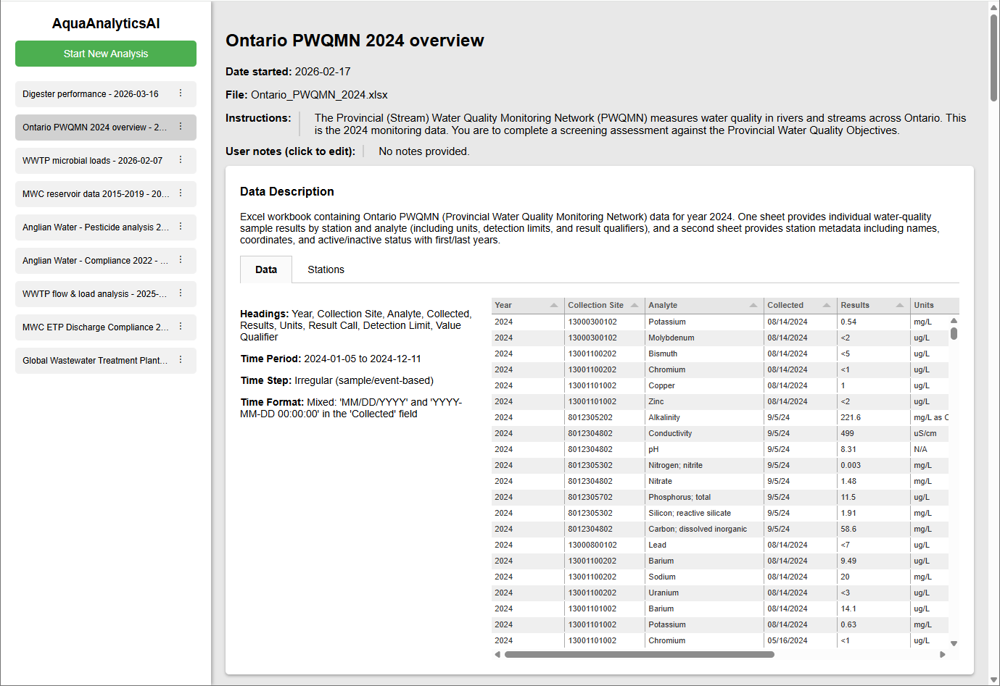
  </a>
</p>

4. **Report:** Generate/revise the report, view the report and code, and download PDF/DOCX. A notification will be shown here if the analysis has been modified since the report was last generated.

<p>
  <a href="docs/images/report_1.png">
    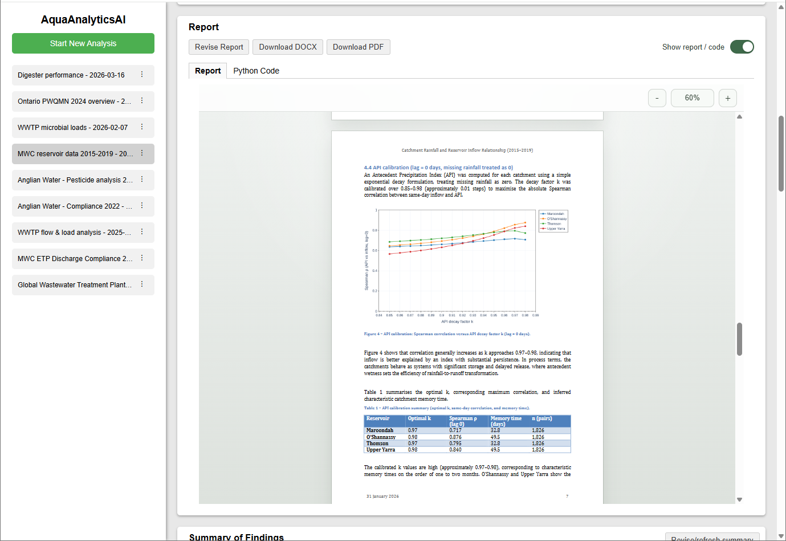
  </a>
  <a href="docs/images/report_2.png">
    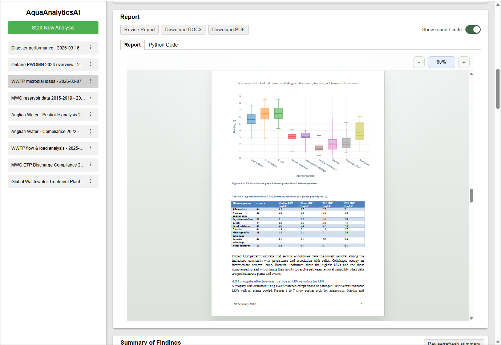
  </a>
  <a href="docs/images/report_3.png">
    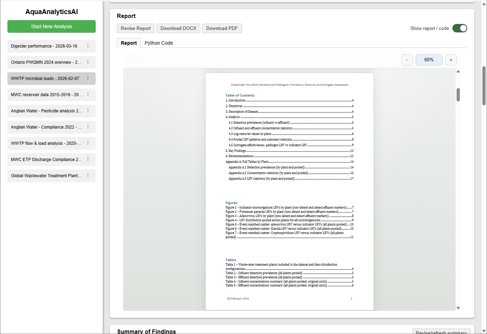
  </a>
</p>

5. **Summary:** Concise LLM-generated overview of findings, with change notification if outdated.

6. **Analysis Components:** A series of LLM-generated analysis components (charts and tables) plus analysis commentary.
    - Click a chart for full-screen interactive view (zoom, toggle series, select data points).
    - Components can be revised or deleted interactively. 

<p>
  <a href="docs/images/analysis_component_1.png">
    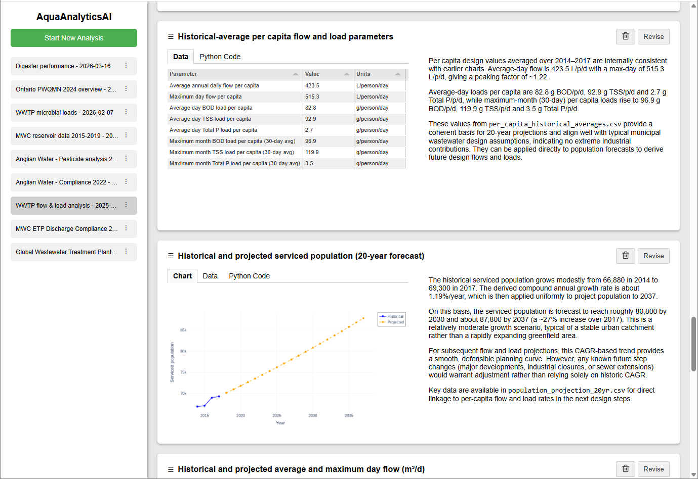
  </a>
  <a href="docs/images/analysis_component_2.png">
    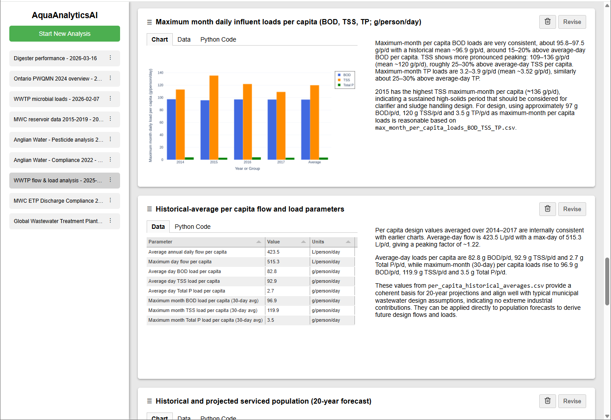
  </a>
  <a href="docs/images/analysis_component_3.png">
    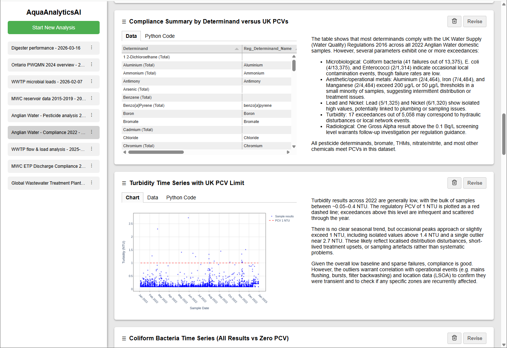
  </a>
</p>


<p>
  <a href="docs/images/analysis_component_interactive_1.png">
    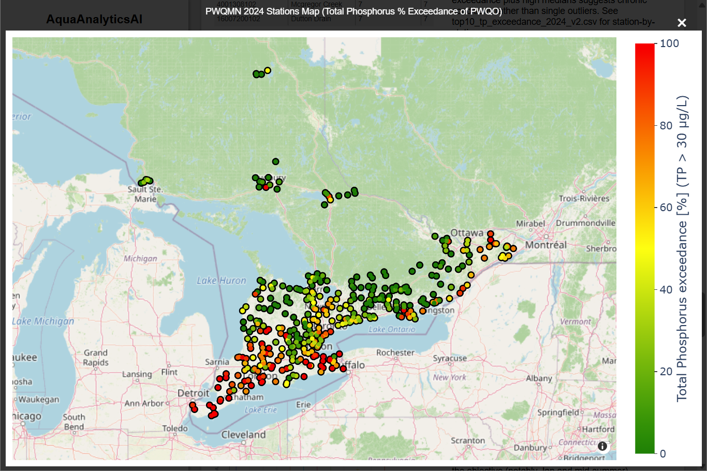
  </a>
  <a href="docs/images/analysis_component_interactive_2.png">
    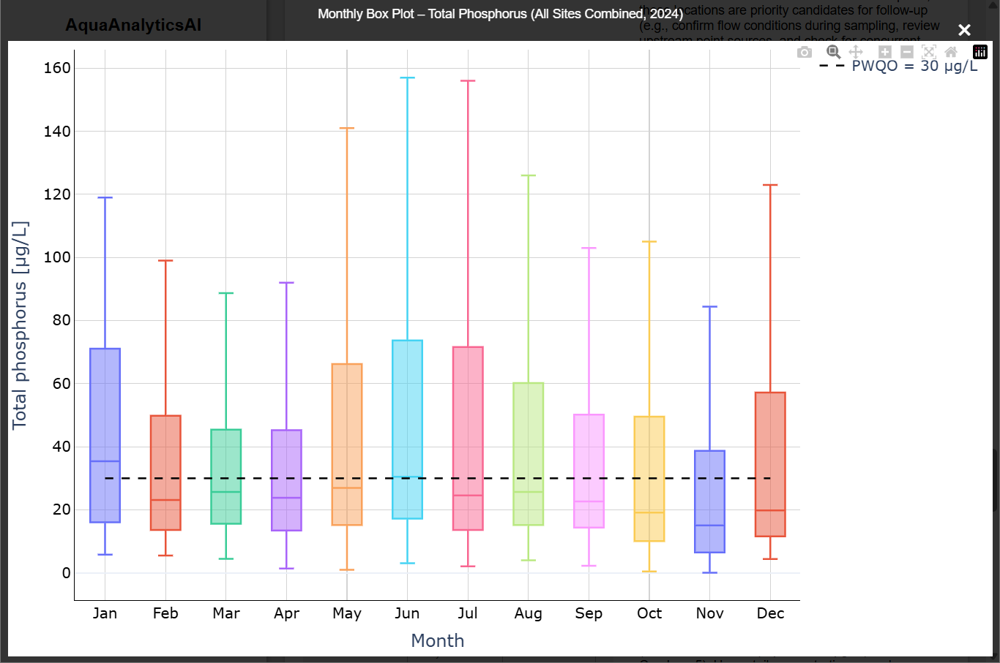
  </a>
  <a href="docs/images/analysis_component_interactive_3.png">
    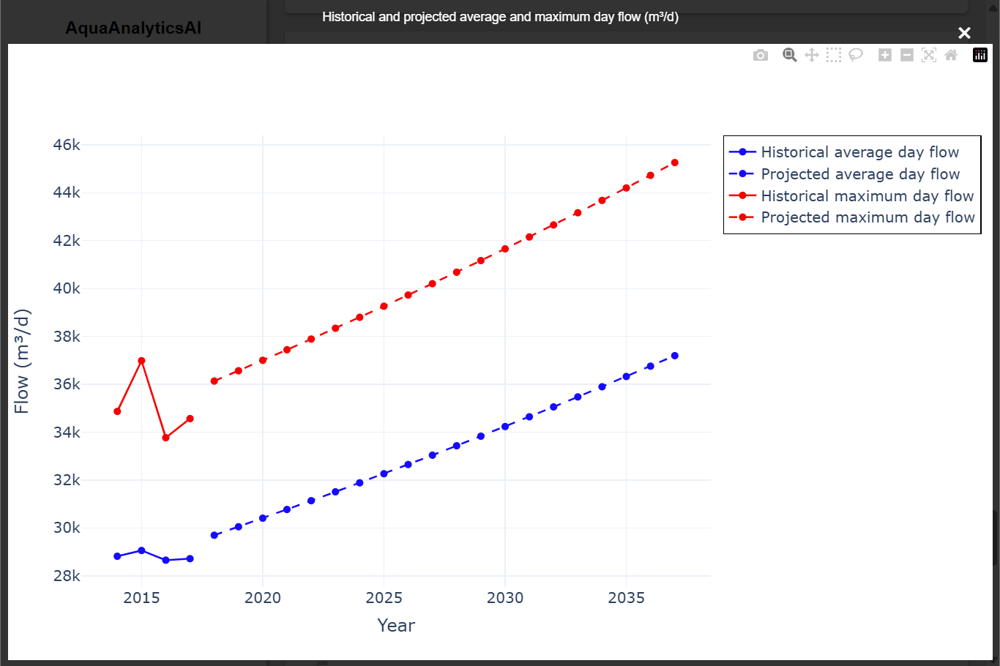
  </a>
</p>


### Start a new analysis

To start a new analysis:

1. Click **Start Analysis** at the top of the left panel.

<p>
  <a href="docs/images/start_new_analysis.png">
    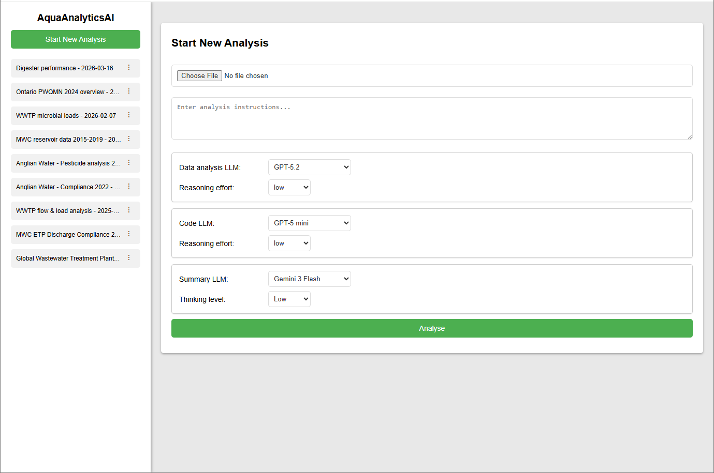
  </a>
</p>

2. Upload a CSV/XLSX file, add optional instructions, and choose LLM configurations for each agent.

3. Click **Analyse**.

4. The green status bar at the top of the right panel shows live progress.

5. When a step is completed, the status bar will allow you to continue (with optional additional instructions) or terminate the analysis run.
    - The first step generates the data description.
    - Subsequent steps generate a series of charts and/or tables, along with analysis commentary.

6. On termination, the summary agent runs to compile conclusions.


### Produce report

For a completed analysis run, you can generate a full report in DOCX format, including embedded charts and tables. An LLM is used to generate Python code to create the DOCX file, with the previously completed analysis passed in as context.

1. In the report section, click **Generate/Revise Report**.

2. Select and configure the LLM to use.

3. (Optional) Choose if the generated report should be returned to the LLM for review and improvement:
    - Either Word or the LibreOffice Docker image must be available. If one is available, the generated DOCX file will be automatically opened (headless), converted to PDF and exported to individual page PNG images. The images are returned to the LLM for review.
    - This option can only be selected with vision capable models.

4. (Optional) If a report was previously generated, include the existing report code and page images as context to request targeted revisions.


### Modify an existing analysis run

Existing analysis runs may be modified:

- Revise an existing analysis component (chart or table).

- Delete an existing analysis component.

- Create a new analysis component.

- Revise the analysis summary.


## LLMs and Agents

Available LLMs are defined in `models.json`. Additional models may be added here and will be available for use in the UI.

Default agent assignments are set in `data_analysis.py`:
```python
# Default LLMs
# process_agent - alias from llm_cfg ALIASES_VISION
DEFAULT_DATA_LLM_ALIAS = "GPT-5.2"
# int_data_coding_agent - alias from llm_cfg ALIASES
DEFAULT_CODE_LLM_ALIAS = "GPT-5 mini"
# summary_agent - alias from llm_cfg ALIASES_VISION
DEFAULT_SUMMARY_LLM_ALIAS = "Gemini 3 Flash"
# report_agent - alias from llm_cfg ALIASES_VISION
DEFAULT_REPORT_LLM_ALIAS = "GPT-5.2"
# Model for reference document query - must be a Gemini model name for reference document queries. This does not use alias pool - provide actual model name - "gemini-2.5-flash-lite" or "gemini-3-flash-preview"
QUERY_REFERENCE_DOC_LLM_NAME = "gemini-2.5-flash-lite"
```

### Agent Roles
| Agent | Function | Recommended Models |
| --- | --- | --- |
| **process_agent** | Orchestrates the workflow and drives core analysis logic. | GPT-5.2<br>Claude Sonnet 4.6<br>(GPT-5.4 and Gemini models are currently not supported for this role) |
| **int_data_coding_agent** | Generates Python for charts and tables. | Smaller models suitable.<br>GPT 4.1-mini<br>GPT 5-mini |
| **summary_agent** | Produces concise findings summary. | Smaller models suitable.<br>Gemini 3 Flash |
| **report_agent** | Writes DOCX code and reviews report. | GPT-5.2<br>Smaller models also suitable.<br>Gemini 3 Flash<br>(Claude models are currently not supported for this role) |
| **query_reference_docs** | Answer queries about PDFs of standards or guidelines.<br>See Reference Documents section. | Gemini 3 Flash / 2.5 Flash-Lite only |


## Reference Documents

The `process_agent` can query reference documents via the `query_reference_doc` tool.
Documents are defined in `reference_docs/reference_docs.json` with descriptive metadata. At runtime, this metadata is dynamically incorporated into tool descriptions.

If needed, the process_agent will select one document to query and provide a prompt for the content it is seeking. Only one document at a time can be queried.

Instead of embeddings (traditional RAG), full PDFs are passed directly into the LLM context. Gemini 3 Flash (or 2.5 Flash-lite) is used due to its ability to process PDF documents directly, a long context window (PDFs up to 1000 pages), and low cost per token. Although slower, this approach yields strong accuracy for large technical documents.

The `query_reference_doc` tool will be disabled if no Gemini API key is provided.

To add a new document to the reference documents:
1. Place the document PDF in `reference_docs`. Ensure the document is 1000 pages or less.

2. Add a new dictionary to the document list in `reference_docs/reference_docs.json`:
    ```json
    {
        "doc_name": "title of document",    // insert the title of your document - this will be included in the tool call description given to the LLM
        "file_name": "filename.pdf",    // filename of your document in reference_docs/ (do not include path)
        "remote_name": "",    // this will be automatically filled in when the document is first uploaded to Gemini
        "upload_date": "",    // this will be automatically filled in when the document is first uploaded to Gemini
        "description_for_llm": "description of document"    // provide a brief description - this will be included in the tool call description given to the LLM
    },
    ```

## Prompts

LLM prompts are constructed from the templates in `prompts/data_analysis.yaml` using Jinja. The `PromptManager` automatically reloads the template at startup.

Edit the YAML file to change agent behavior.

## Docker Details
Two helper images are used:
1. Code Execution Image – runs LLM-generated Python securely.
2. LibreOffice Image – handles DOCX → PDF conversion when Word isn’t available.

### Code Execution Docker Image
The system is configured to run all LLM-generated code in a Docker container.

Build the analysis executor image:
  ```bash
  docker build -t data-analysis:latest ./docker/code-exec
  ```

  This container is set up with the typical packages needed. If an LLM attempts to use a missing Python package, either:
  - Adjust prompts to avoid that dependency, or
  - Add it to `docker/code-exec/requirements-docker.txt` and rebuild the image.


### LibreOffice Docker Image
- On Windows, the system will use Microsoft Word (headless) if available for report DOCX field refresh + PDF export.
- On other systems, it falls back to the LibreOffice Docker image (PDF export only; no DOCX field updates).
- If neither Word nor the LibreOffice image are available, automated report review and improvement will be disabled as page images of the document cannot be produced to return to the LLM.

Build the headless LibreOffice image:
  ```bash
  docker build -t lo-headless:latest ./docker/libreoffice
  ```


## License

This project is licensed under the [Apache License 2.0](LICENSE).

You are free to use, modify, and distribute this software for commercial or non-commercial purposes, provided that proper attribution is maintained.  
See the LICENSE file for full terms.
